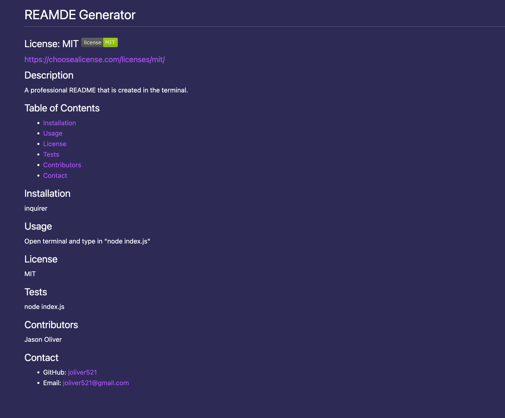

# README Generator

Quickly create a professional README. You will be prompted with questions about your project.

A command-line application that dynamically generates a README.md from the user's input. The application will be invoked with the following command:

```
node index.js
```

Layout and content were built using JavaScript, NodeJS and Inquirer.

## README Walkthrough Video

### [Video of the function of the README Generator](https://drive.google.com/file/d/1pZq-Hqrw67C-MqaGepLQNTY1QhzrAZRP/view?usp=sharing)



## Website Function:

- Invoke the application using "node index.js.

- You will then be prompted by a series of questions about your project.

- When you answer all of the questions, the README app will generate a professional README file.

## GitHub repository for challenge 9

- [Github Repo](https://github.com/joliver521/README-generator)

## Live website for challenge 9

- [README-Generator](https://joliver521.github.io/README-generator/)
